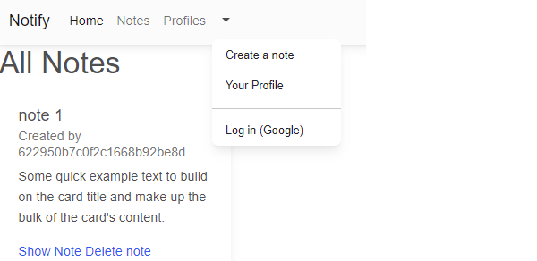

<div id="top"></div>


<!-- PROJECT LOGO -->
<br />
<div align="center">
  <a href="https://github.com/PrinceJonaa/Notify">
    
  </a>

<h3 align="center">Notify</h3>

  <p align="center">
    Create, Save, and Save Notes with others
    <br />
    <a href="https://github.com/PrinceJonaa/Notify"><strong>Explore the docs »</strong></a>
    <br />
    <br />
    <a href="https://github.com/PrinceJonaa/Notify">View Demo</a>
    ·
    <a href="https://github.com/PrinceJonaa/Notify/issues">Report Bug</a>
    ·
    <a href="https://github.com/PrinceJonaa/Notify/issues">Request Feature</a>
  </p>
</div>

<!-- TABLE OF CONTENTS -->
<details>
  <summary>Table of Contents</summary>
  <ol>
    <li>
      <a href="#about-the-project">About The Project</a>
      <ul>
        <li><a href="#built-with">Built With</a></li>
      </ul>
    </li>
    <li><a href="#usage">Usage</a></li>
    <li><a href="#roadmap">Roadmap</a></li>
    <li><a href="#contributing">Contributing</a></li>
    <li><a href="#license">License</a></li>
    <li><a href="#contact">Contact</a></li>
    <li><a href="#acknowledgments">Acknowledgments</a></li>
  </ol>
</details>

<!-- ABOUT THE PROJECT -->
## About The Project



A web application that allows you to view, create, edit, delete & save notes among others.

<p align="right">(<a href="#top">back to top</a>)</p>

### Built With

* [Node.js](https://nextjs.org/)
* [Mongo.db](https://www.mongodb.com/)
* [Bootstrap](https://getbootstrap.com)
* [Material-UI](https://material-ui.com/)
* [Express](https://expressjs.com/)

<p align="right">(<a href="#top">back to top</a>)</p>

<!-- GETTING STARTED -->
## Getting Started

You must log in with google to create, edit, delete & save notes.

### Local hosting

If you want to run the project locally and host your own server, you will need the following:


### Installation

1. Get a free API Key at [https://notify-app-1.herokuapp.com](https://example.com)
2. Clone the repo

   ```sh
   git clone https://github.com/PrinceJonaa/Notify.git
   ```

3. Install NPM packages

   ```sh
   npm i
   ```

4. Enter your .env in the root directory and replace 'xxx' with proper values.

   ```
   DATABASE_URL= XXX;
   GOOGLE_CALLBACK= XXX;
   GOOGLE_CLIENT_ID= XXX;
   GOOGLE_SECRET= XXX;
   SESSION_SECRET= XXX;
   ```

<p align="right">(<a href="#top">back to top</a>)</p>

<!-- USAGE EXAMPLES -->
## Usage

Adding in here later..

_For more examples, please refer to the [Documentation](https://example.com)_

<p align="right">(<a href="#top">back to top</a>)</p>

<!-- ROADMAP -->
## Roadmap

* [ ] Light / Dark Mode
* [ ] Different Catagories
* [ ] WYSIWYG Editor

See the [open issues](https://github.com/PrinceJonaa/Notify/issues) for a full list of proposed features (and known issues).

<p align="right">(<a href="#top">back to top</a>)</p>

<!-- CONTRIBUTING -->
## Contributing

Contributions are what make the open source community such an amazing place to learn, inspire, and create. Any contributions you make are **greatly appreciated**.

If you have a suggestion that would make this better, please fork the repo and create a pull request. You can also simply open an issue with the tag "enhancement".
Don't forget to give the project a star! Thanks again!

1. Fork the Project
2. Create your Feature Branch (`git checkout -b feature/AmazingFeature`)
3. Commit your Changes (`git commit -m 'Add some AmazingFeature'`)
4. Push to the Branch (`git push origin feature/AmazingFeature`)
5. Open a Pull Request

<p align="right">(<a href="#top">back to top</a>)</p>

<!-- LICENSE -->
## License

Writing in progress...

<p align="right">(<a href="#top">back to top</a>)</p>

<!-- CONTACT -->
## Contact

Your Name - [@PrinceJonaa](https://twitter.com/PrinceJonaa

Project Link: [https://github.com/PrinceJonaa/Notify](https://github.com/PrinceJonaa/Notify)

<p align="right">(<a href="#top">back to top</a>)</p>

<!-- ACKNOWLEDGMENTS -->
## Acknowledgments

* [Bootstrap]()
* [My Gf]()
* [Taco Cat]()

<p align="right">(<a href="#top">back to top</a>)</p>

[![Issues][issues-shield]][issues-url]
[![LinkedIn][linkedin-shield]][linkedin-url]


<!-- MARKDOWN LINKS & IMAGES -->
<!-- https://www.markdownguide.org/basic-syntax/#reference-style-links -->
[contributors-shield]: https://img.shields.io/github/contributors/PrinceJonaa/Notify.svg?style=for-the-badge
[contributors-url]: https://github.com/PrinceJonaa/Notify/graphs/contributors
[forks-shield]: https://img.shields.io/github/forks/PrinceJonaa/Notify.svg?style=for-the-badge
[forks-url]: https://github.com/PrinceJonaa/Notify/network/members
[stars-shield]: https://img.shields.io/github/stars/PrinceJonaa/Notify.svg?style=for-the-badge
[stars-url]: https://github.com/PrinceJonaa/Notify/stargazers
[issues-shield]: https://img.shields.io/github/issues/PrinceJonaa/Notify.svg?style=for-the-badge
[issues-url]: https://github.com/PrinceJonaa/Notify/issues
[license-shield]: https://img.shields.io/github/license/PrinceJonaa/Notify.svg?style=for-the-badge
[license-url]: https://github.com/PrinceJonaa/Notify/blob/master/LICENSE.txt
[linkedin-shield]: https://img.shields.io/badge/-LinkedIn-black.svg?style=for-the-badge&logo=linkedin&colorB=555
[linkedin-url]: https://linkedin.com/in/jonathan-bonner-professional
[product-screenshot]: images/screenshot.png
